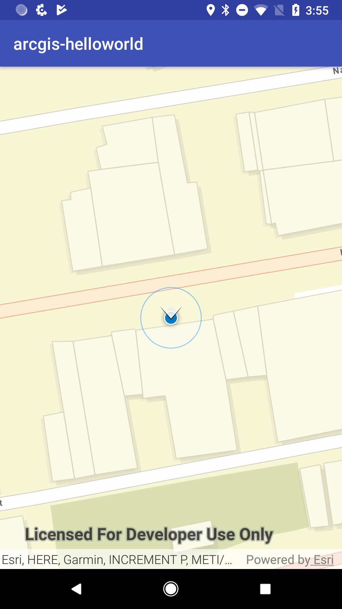

This is an example of Navisens' SDK integration with ArcGIS' SDK.

Then retrieve a Navisens SDK key [here](https://navisens.com/).  
And add it to the `MotionDnaDataSource` constructor (which will subsequently input it into `runMotionDna`)
in the `MainActivity.java` file.

When you are done with your key retrieval, you can just run the project and it will work out of the box.

Have fun!

